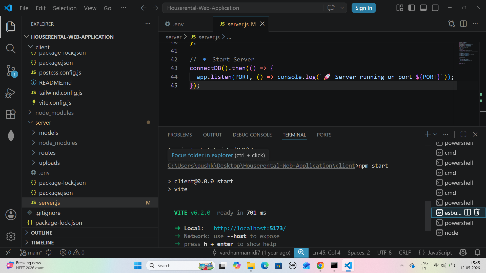
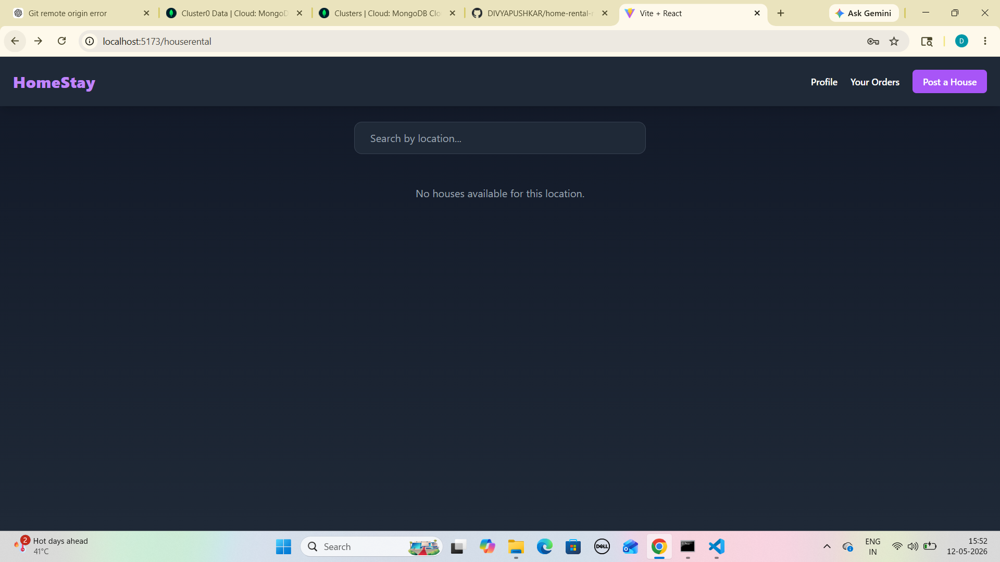
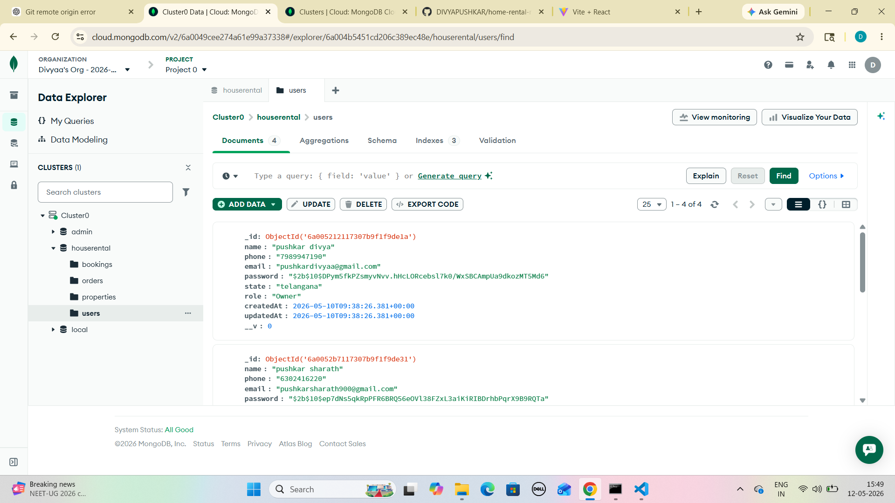
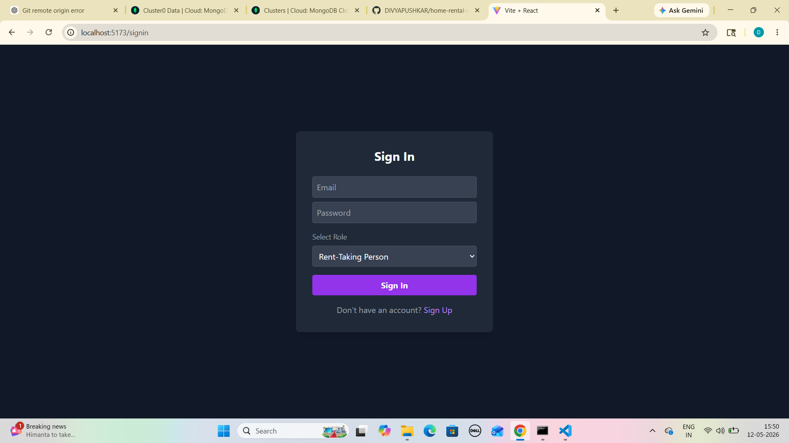
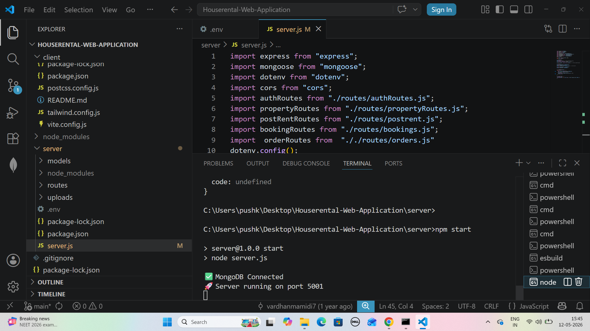

# House Rental Web Application

A MERN stack web application for browsing, posting, and booking rental properties online.

## Tech Stack
- React.js
- Node.js
- Express.js
- MongoDB

---

## Installation

### Clone Repository
step 1 :
```bash
git clone https://github.com/DIVYAPUSHKAR/home-rental-mern-.git

step 2: Open Project Folder
cd home-rental-mern-
step 3 : Install Frontend Dependencies
cd client
npm install
step 4 : Install Backend Dependencies
cd ../server
npm install
step 5: Create .env File
Create a .env file inside the server folder and add:
MONGO_URI=your_mongodb_connection_string
JWT_SECRET=your_secret_key
PORT=5001
step 6: Run Project
Start Backend Server
cd server
npm start
step 7: Start Frontend
Open another terminal:
cd client
npm start


## 📸 Screenshots

### Client


### Dashboard


### Database Saving


### Login Page


### Server
